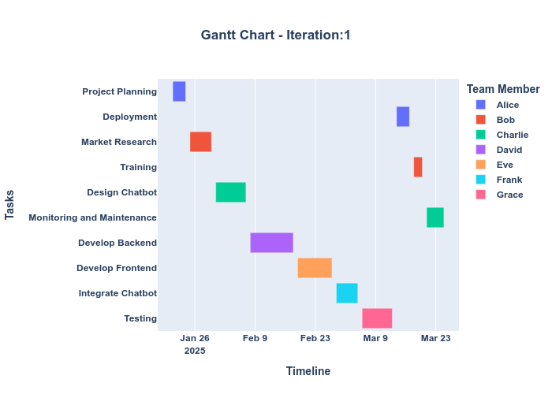

# 项目管理Agents

## 项目介绍
这个项目旨在管理和可视化项目任务。通过分析项目的状态和风险评分，提供有价值的见解，并生成项目时间线的可视化图表。

:Warning 本项目不用于真实的项目管理，仅仅用于学习使用

## QuickStart
### 环境准备
1. 克隆或下载项目代码到本地。

2. 确保已安装所需的依赖库，可以使用以下命令安装：
    ```bash
    pip install -r requirements.txt
    ```

### 环境变量
准备glm 的api_key 并保存到`.env`文件中

###
准备`project_description.txt`以及`team.csv`
* project_description.txt: 描述你的项目目标
* team.csv: 定义项目组员以及各自的背景描述

### 运行主程序
3. 运行主程序：
    ```bash
    python main_task_mgr.py
    ```

## 输出结果说明
运行程序后，将会输出以下信息：
- 当前节点
- 迭代次数
- 项目风险评分迭代
- 见解

此外，程序还会生成项目时间线的可视化图表。

## 示例输出
```plaintext
Current node: <当前节点>
iteration_number: <迭代次数>
project_risk_score_iterations: <项目风险评分迭代>
insights: <见解>
```
可视化图表
程序会调用 visalize_project_timeline 函数生成项目时间线的可视化图表，帮助用户更好地理解项目进展。
以下是例子：



# Futher work
