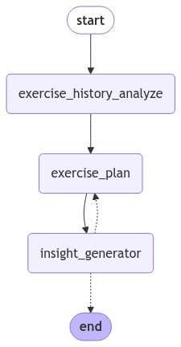
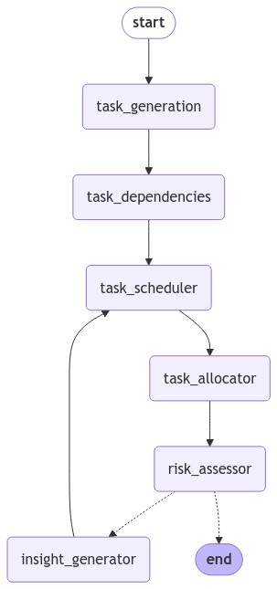
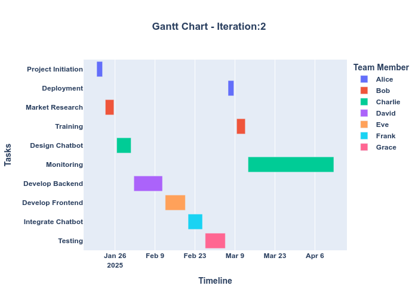

# Easy Agents

## 项目介绍
这个项目旨在提供简易的agent应用程序，利用本项目，你可以学习到
* `Agent State`, `workflow`, `node`的含义；
* agent之间的消息传递方式；
* 一个简易的agent程序结构。

本项目包含了两个agent实例：
* exercise management Agents: 结合历史行为信息，可以提供次日的锻炼计划；


* project management Agents: 通过定义的项目定义和成员信息，进行项目管理。



## QuickStart
### 环境准备
1. 克隆或下载项目代码到本地。
    ```
    git clone https://github.com/develop-productivity/easy_management_agent.git
    ```

2. 确保已安装所需的依赖库，可以使用以下命令安装：
    ```bash
    cd easy_management_agent
    pip install -r requirements.txt
    ```

### 环境变量
准备glm 的api_key 并保存到`.env`文件中

### 其他必要文件
为了运行project management Agents 需要准备以下文件：
* `project_description.txt`: 描述你的项目目标
* `team.csv`: 定义项目组员以及各自的背景描述

你可以参照`src/data/task_data/project_description.txt`和`src/data/task_data/team.csv` 中的例子。

为了运行exercise management Agents 需要准备以下文件：
* `behavior_history.csv`: 包含了 `date`, `tasks`, `duration`, `intensity`, `calories`, `mood`, `sleep` 表头。
  
你可以参照`src/data/exer_data/behavior_history.csv`中的例子。

### 运行文件
为了方便学习，准备两个`jupyter`文件：`exercise_mgr.ipynb`和`project_mgr.ipynb`

分别对应了健身和项目管理的agents 对应的文件。提高了整体程序的可读性，易于新手理解。

### 结果展示
当运行`project_mgr.ipynb`你将得到如下输出结果：


当运行`exercise_mgr.ipynb`你将得到如下输出结果：
```
Next day exercise plan: {'tasks': ['run', 'cycle', 'yoga', 'stretch'], 'duration': [45, 30, 20, 15], 'intensity': [0.6, 0.7, 0.5, 0.4]}
Next day exercise insight:  The user has a consistent exercise routine with a mix of activities, but the intensity seems to be on the lower side. Increasing the intensity of the workouts, particularly the running and cycling sessions, could potentially enhance calorie burn and weight loss. Additionally, incorporating more challenging yoga and stretching routines might improve flexibility and muscle tone.
Next day exercise score :  7
```
